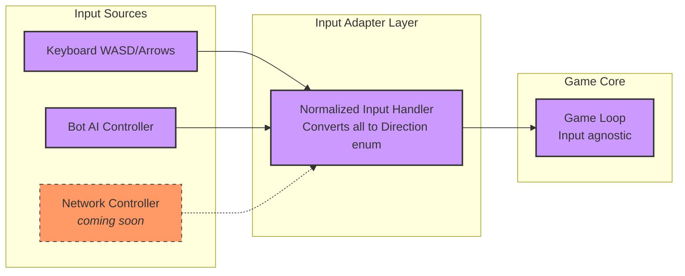
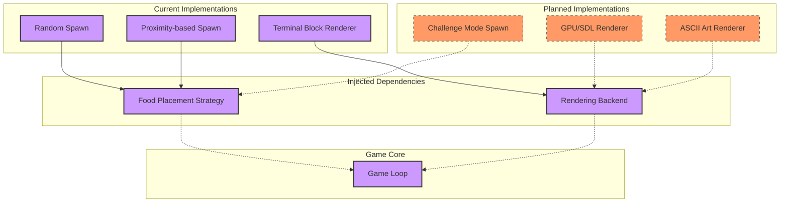
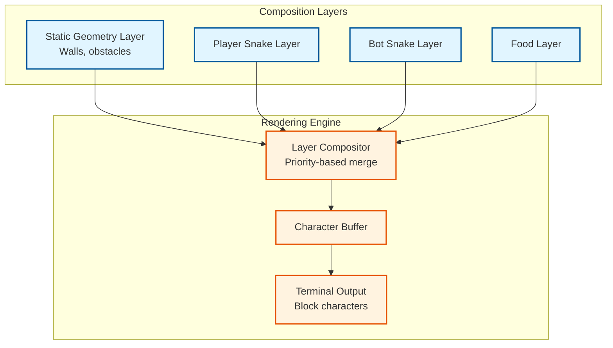

# C4Snake

A high-performance, terminal-based snake game written in **raw C** with zero dependencies. Built with clean architecture principles, dependency injection, and the adapter pattern to support multiple input sources and rendering backends.


## Preview
https://github.com/user-attachments/assets/f95e3a60-eb6b-4c5b-bdad-1a115d532b7c


## Quick Start

```bash
# Build
make

# Run
./snake

# Controls
WASD or Arrow Keys - Move
Q - Quit
```

**Requirements:** 
- macOS (primary) or Linux
- Clang compiler
- Terminal with UTF-8 support

---

## Current Features ✓

- **Classic snake gameplay** in confined arena
- **Bot AI player** - autonomous snake opponent with pathfinding
- **Two food placement strategies:**
  - Random spawning
  - Proximity-based (closer to snakes for competitive gameplay)
- **Collision detection** - walls and snake-on-snake
- **Terminal rendering** using block characters

---

## Architecture Overview

Built with extensibility in mind. Two core design patterns keep this maintainable:

### 1. Adapter Pattern (Input Abstraction)



**Why this matters:** Adding network-controlled snakes or gamepad input requires zero changes to game logic. Just implement a new adapter.

### 2. Dependency Injection (Swappable Strategies)



**Why this matters:** Want a graphical version? Inject an SDL renderer. Need different difficulty modes? Inject a new food strategy. Core game logic never changes.

---

## Rendering Pipeline

Multi-layered composition system that separates concerns:



**Design benefit:** Each entity renders on its own layer, preventing state corruption. Want to add a new visual element? Add a new layer. Want to switch from terminal to GPU rendering? Replace the output stage.

---

## AI System

The bot uses a heuristic-based decision engine:

1. **Candidate move generation** - forward, left, right (no reversing)
2. **Safety check** - collision detection against walls and snakes
3. **Heuristic scoring:**
   - **Voronoi territory control** - BFS flood-fill to measure reachable space
   - **A* pathfinding** - distance to nearest food
4. **Move selection** - highest scoring safe move wins

This creates an AI that prioritizes survival over greedy food collection.

---

## Roadmap

### Phase 1: Core Gameplay ✓
- [x] Basic snake movement
- [x] Food consumption and growth
- [x] Collision detection
- [x] Bot AI opponent
- [x] Dual food strategies

### Phase 2: Multiplayer (In Progress)
- [ ] Network protocol design
- [ ] Network-controlled snake adapter
- [ ] Synchronization and lag compensation
- [ ] Spectator mode

### Phase 3: Enhanced Rendering
- [x] POV (player-centered) camera mode
- [ ] Color themes
- [ ] Alternative renderers (SDL, OpenGL)
- [ ] Replay system

### Phase 4: Advanced Features
- [ ] Multiple AI difficulty levels
- [ ] Custom arena shapes
- [ ] Power-ups and obstacles
- [ ] Configuration file support

---

## Build System

Simple Makefile-based build:

```bash
# Development build
make

# Clean build artifacts
make clean

# Debug build (with symbols)
make debug
```

**Tested on:**
- macOS (Clang)
- Linux (GCC/Clang) - experimental

---

## Project Structure

```
c4snake/
├── src/           # Source files
├── include/       # Header files
├── Makefile       # Build configuration
└── README.md
```

*(Structure will evolve as features are added)*

---

## Design Philosophy

**Zero dependencies.** Everything is raw C and POSIX APIs. No ncurses, no SDL (yet). This keeps the codebase portable and the architecture clear.

**Separation of concerns.** Game logic knows nothing about terminals, keyboards, or rendering. Input adapters normalize all sources. Dependency injection keeps strategies swappable.

**Built for extension.** The architecture is overengineered for a snake game *on purpose*. This is a learning project demonstrating enterprise-grade patterns in systems programming.

---

## Contributing

This is an educational project exploring clean architecture in C. Contributions welcome, especially:

- Cross-platform terminal handling improvements
- New food placement strategies
- Alternative rendering backends
- Network protocol implementation

---

## License

MIT License - see LICENSE file for details

---

## Why "C4Snake"?

**C** for the language. **4** for the four core architectural layers (Input → Logic → Composition → Render). **Snake** because, well, it's snake.
